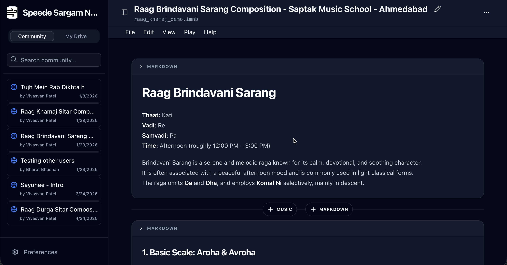
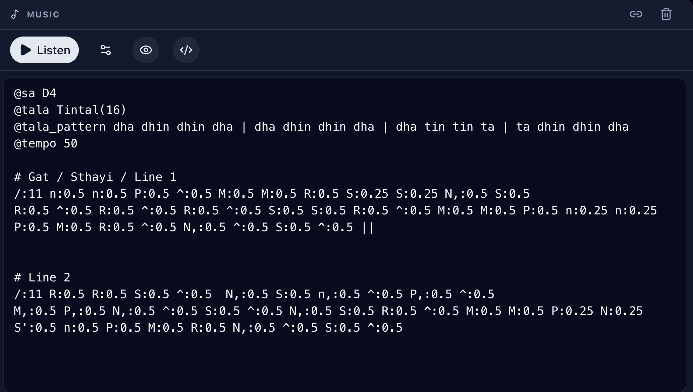

# Sargam 🎼


> An advanced Indian Classical Music notebook environment allowing you to compose, edit, and play sargam notations alongside rich markdown text.

## 🌟 Features

- **Mixed Media Notebooks**: Seamlessly combine Markdown text and interactive Music cells in a `.imnb` format.
- **Sargam Notation Support**: First-class support for `sargam-v1` DSL, allowing precise notation of Swaras, rhythmic cycles (Talas), and ornamentation.
- **Microtonal Playback**: Authentic playback engine supporting microtones (Shrutis) and complex ornamentations like Meend and Gamak.
- **Interactive Playback Controls**: Real-time control over tempo, loop, and specific instrument volumes (Tanpura, Tabla, Lehra).
- **Export & Share**: (Coming soon) Export your compositions to standard formats.

## 🖼️ Screenshots

<div align="center">
  
  <p><em>The intuitive notebook interface for composing Indian Classical Music.</em></p>
</div>

<br />

<div align="center">
  
  <p><em>Sargam notation with rich language support.</em></p>
</div>

## 🚀 Getting Started

### Prerequisites

- Node.js (v18+)
- Python (v3.10+) for backend/parser tools

### Installation

1.  **Clone the repository**

    ```bash
    git clone https://github.com/vivasvan1/sargam-v1.git
    cd sargam-v1
    ```

2.  **Install Frontend Dependencies**

    ```bash
    cd frontend
    npm install
    # or
    bun install
    ```

3.  **Configure Google Login**

    ```bash
    cp .env.example .env.local
    ```

    Set `VITE_GOOGLE_CLIENT_ID` in `frontend/.env.local`. The app now requires
    Google sign-in before it saves or loads files from your personal Drive.

    In the Google Cloud Console OAuth client, add the app URL under
    **Authorized JavaScript origins**:
    - Production: `https://sargam.speede.site`
    - Local development: `http://localhost:5174`

    The app only requests Google Drive `drive.file` access. Community notebooks
    are served from the public Apps Script registry rather than by reading other
    users' Drive files.

4.  **Configure the Community Registry**

    Create a Google Sheet with two tabs:
    - `Registry`: `ID`, `Name`, `Author`, `Description`, `Date`, `OwnerEmail`
    - `Content`: `ID`, `ChunkIndex`, `ChunkText`, `UpdatedAt`

    Paste `frontend/src/lib/appscript.gs` into the Sheet's Apps Script editor
    and deploy it as a Web App that executes as you and is accessible to anyone.
    Published notebooks are stored as snapshot JSON chunks in the `Content` tab.

5.  **Run Development Server**

    ```bash
    npm run dev
    ```

    The app will be available at `http://localhost:5174`.

## 🛠️ Tech Stack

- **Frontend**: React, Vite, TailwindCSS, Radix UI, Lucide React
- **Audio Engine**: Tone.js
- **Editor**: CodeMirror (with custom DSL highlighting)
- **Backend/Parser**: Python

## ☁️ Deployment

This project is optimized for deployment on Vercel.

[](https://vercel.com/new/clone?repository-url=https%3A%2F%2Fgithub.com%2Fvivasvan1%2Fsargam-v1%2Ftree%2Fmain%2Ffrontend)

### Manual Deployment

1.  Install Vercel CLI: `npm i -g vercel`
2.  Run `vercel` in the `frontend` directory.

---

Built with ❤️ for Indian Classical Music.
